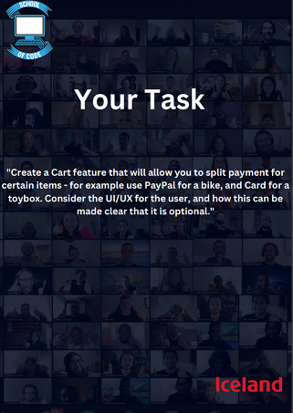
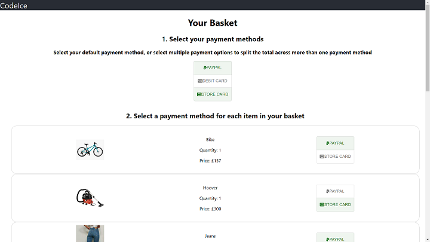
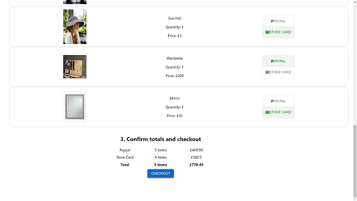
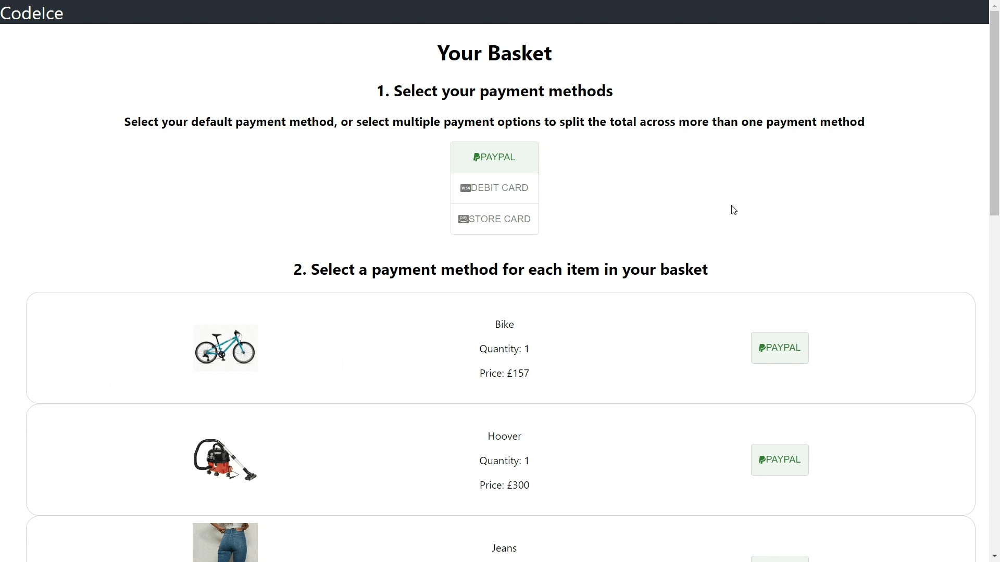

# Iceland Hackathon

We created this app as part of a one-day hackathon project, where our goal was to create a cart feature that allows users to (optionally) split their payment across multiple payment methods.

We discussed several ways to implement this feature, focusing on how to make it intuitive for the user whilst avoiding making the page too 'busy'.



## Contents

1. [Usage](#usage)

2. [Screenshots](#screenshots)

3. [Contributors](#contributors)

## Usage

```
git clone https://github.com/DHawkesford/iceland.git
npm i
npm start
```

## Screenshots







### Contributors

- Shabana Kauser ([@shabana89](https://github.com/shabana89))
- Dan Hawkesford ([@DHawkesford](https://github.com/dhawkesford))
- [@widget128](https://github.com/widget128)
- [@Codeama](https://github.com/Codeama)

[Back to top](#iceland-hackathon)